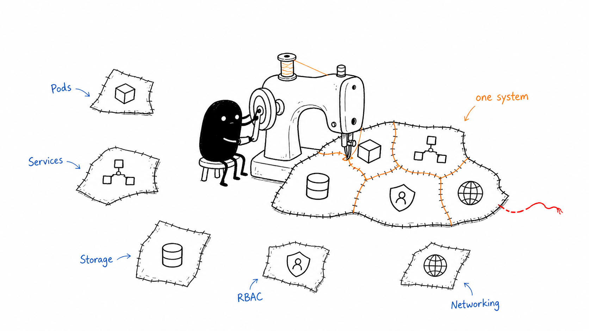
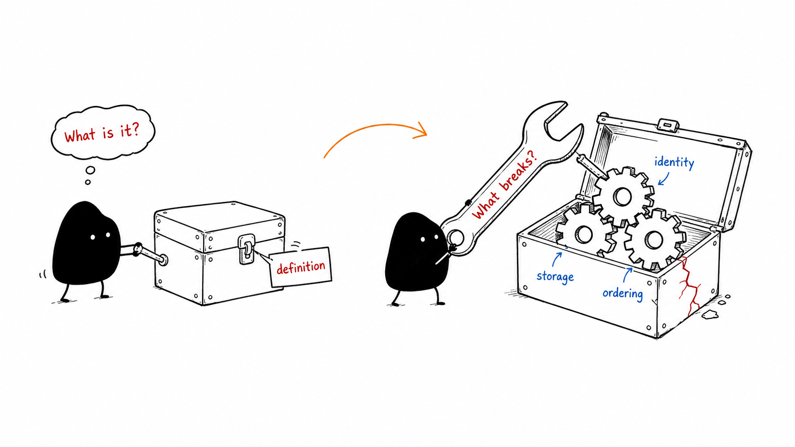
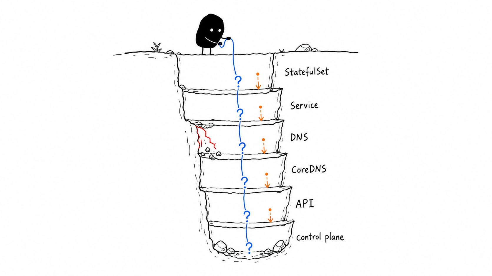
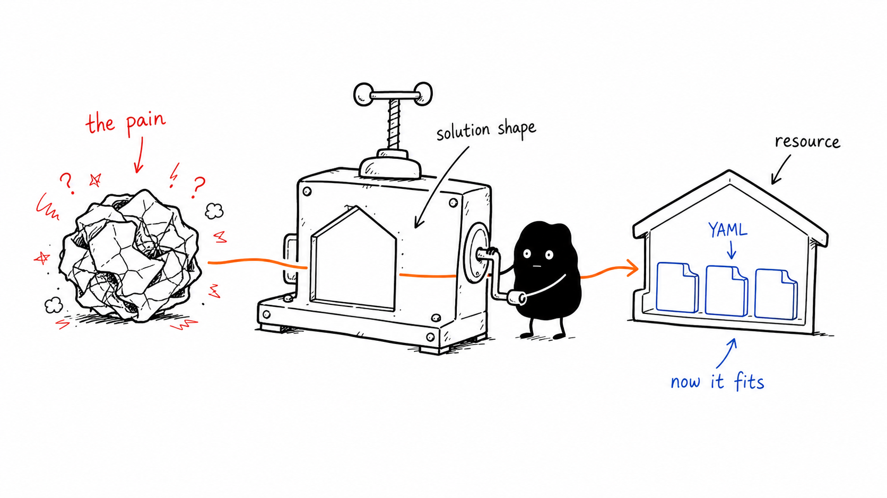
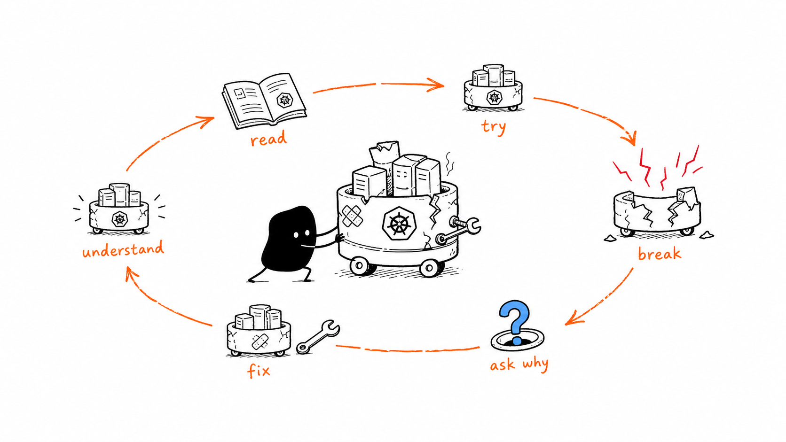

Most people hear "I'm learning Kubernetes" and picture something tidy. A certification path. A book with sticky notes in it. Maybe a training course with modules, quizzes, and a progress bar.

Mine has not looked like that.

Most of it has come from building small things, breaking them, staring at `kubectl` output, and asking better questions the next time around. Lately, one of the tools I keep coming back to is Codex.

## The Problem With Learning Kubernetes

Kubernetes gets wide very quickly.

You start with Pods. Then Deployments. Then Services and Ingress. That part feels manageable for about five minutes, and then you run into networking, storage, RBAC, service accounts, Helm, GitOps, StatefulSets, affinity rules, taints, CNI plugins, CSI drivers, certificates, and half a dozen words that sound simple until you try to explain them back to yourself.

The information is everywhere.

The hard part is joining it together.



A lot of tutorials are good at explaining what a resource does. A Pod runs containers. A Service gives you a stable way to reach them. An Ingress gets traffic into the cluster. Those definitions help, but they don't always answer the question I care about most: why does this thing exist at all?

That is where Codex has been useful for me. I do not treat it like a search engine. I treat it more like someone sitting next to me while I am poking at a cluster.

## How I Actually Use It

When I hit a Kubernetes concept I do not understand, I try not to ask for the textbook definition first.

I ask the annoying questions.

Why does this exist? What broke badly enough that Kubernetes needed this object? What would happen if I skipped it? What would I use instead? When would this be the wrong tool?

For example, I could ask:

> What is a StatefulSet?

That gives me an answer, but it is usually not the answer that makes the idea click.

The better question is:

> Why can't I just use a Deployment for this? What breaks?



Now the conversation has somewhere to go. You start talking about stable network identity, ordered rollouts, persistent volumes, DNS names, and why a database pod is different from a stateless web app. It stops being a Kubernetes vocabulary lesson and starts becoming a model of the system.

That is what I am after.

## Following the Thread

The part I like most is being able to keep drilling down without starting over.

A normal conversation might go something like this:

```text {filename="A learning conversation"}
What is a StatefulSet?

↓

Why can't a Deployment do that?

↓

How does DNS work for StatefulSets?

↓

What creates those DNS records?

↓

How does CoreDNS know about them?

↓

Where is that information stored?
```

By the end, I am not just learning what a StatefulSet is. I am tracing the path through Services, DNS, CoreDNS, the Kubernetes API, and the control plane.



That is a very different kind of learning.

It also exposes the gaps quickly. Sometimes I realise I do not understand Services as well as I thought. Or I know what CoreDNS does in theory, but I cannot describe how it learns about new records. Good. That gives me the next question.

## The Skill I Built

After a while, I noticed I was asking Codex for the same kind of explanation again and again.

I wanted Kubernetes answers that started with the problem, not the API object. Beginner friendly, but not shallow. Practical, but still willing to go down a level when I asked. The kind of explanation you might get from a senior engineer who has seen the weird failure modes before.

So I made a Codex skill called `learn-k8s`:

https://github.com/danohn/learn-k8s

The idea is simple. When I ask about Kubernetes, I want Codex to slow down and teach the concept from first principles.

Start with the thing that hurts. Then explain the shape of the solution. Then introduce the Kubernetes resource and show how it fits into a real cluster.

That order matters. If I start with the YAML, I usually end up memorising fields. If I start with the problem, the YAML has somewhere to live in my head.



## Building Real Clusters

I made one mistake early on: I tried to learn too much Kubernetes from diagrams.

Diagrams help. They give you the map. But the map gets a lot more useful after you have watched a CNI install fail, chased a broken Ingress, or wondered why a pod can mount a volume on one node but not another.

Over the last few months I have built clusters with kubeadm, k3s, Talos Linux, and managed Kubernetes services. None of them taught me as much when they worked as they did when they broke.

A failed CNI install made networking feel real. A broken Ingress forced me to follow traffic from the outside world into the cluster. A storage issue made PersistentVolumes stop being an abstract resource. RBAC only really landed once I hit an authentication problem and had to work out which identity was doing what.

That is when Kubernetes starts to stick.

## AI Does Not Replace the Work

Codex does not replace the docs.

It does not replace labs. It definitely does not replace running the system yourself and dealing with the mess when something goes sideways.

What it gives me is fast feedback while I am already in the problem. Instead of reading five blog posts and trying to stitch the answer together, I can ask the next question in the same thread. Then another one. Then a more specific one after I run a command and get a weird result back.

That loop matters.

Read a bit. Try something. Break it. Ask why. Fix it. Ask what actually happened.



For me, that has been the useful part of AI-assisted learning. It keeps me close to the problem long enough for the idea to click.

## What I Still Need to Learn

I am still very much learning Kubernetes.

There are whole areas I have only touched lightly: advanced networking, multi-cluster setups, service meshes, operators, production observability, and the darker corners of scheduling.

But the combination has worked well for me so far. Real clusters, official docs, hands-on experiments, and Codex as a patient person to ask "why?" for the tenth time.

If you are learning Kubernetes too, my advice is to build something small and real. Break it in a way that annoys you. Fix it. Then ask enough questions that you understand why the fix worked.

I am still doing exactly that.

<p class="image-attribution">Images inspired by Ian Xiaohei Illustrations</p>
